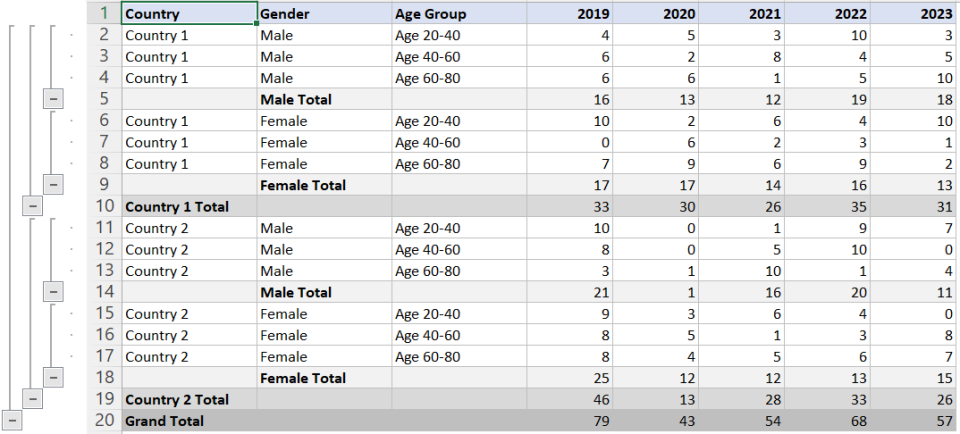

# Forecast Pioneer 📊🚀

Welcome to the Forecast Pioneer repository, home to an innovative prototype designed to organize and manage forecasts effectively using an intuitive grid-based system.

## Application Prototype  📝

### Problem Statement
Develop an application prototype to view and manage forecasts for various attributes comprehensively.

### Episode Parameters 🗂️

The prototype showcases an advanced grid layout similar to a Pivot table, organizing forecasts by periods (columns) and offering multi-level drill-downs (rows) for detailed analysis.

#### Expected Interface 🖥️

🔍 The anticipated interface demonstrates a configurable grid enabling diverse drill-down levels and seamless value aggregation upon modifications.

#### Actual Prototype 🚀

🌟 Our application prototype mirrors the expected design, ensuring configurable drill-downs, automated value aggregation, and efficient data copying functionalities between cells.

### Rules & Requirements 📋
- Configure custom drill-down levels and labels effortlessly.
- Enable automatic value aggregation across levels on input or change.
- Redistribute values based on specified ratios for fresh inputs.
- Facilitate seamless information copying between cells or sets of cells.

## Participation & Timelines ⏳
[Include details on participation eligibility, team criteria, and episode timelines...]

## Deliverables & Evaluation Criteria 🏆
[Specify submission requirements and criteria for evaluating prototypes...]

### Tech Stack & Future Assumptions 🛠️
- Angular version: 15.8.2
- Utilizes MongoDB for efficient data handling.
- Future improvements: UI enhancements, cloud deployment for scalability.

### Deployment & Security Features 🔒
- Deployable on cloud platforms for scalability.
- Implements user authentication and authorization for secure access.

