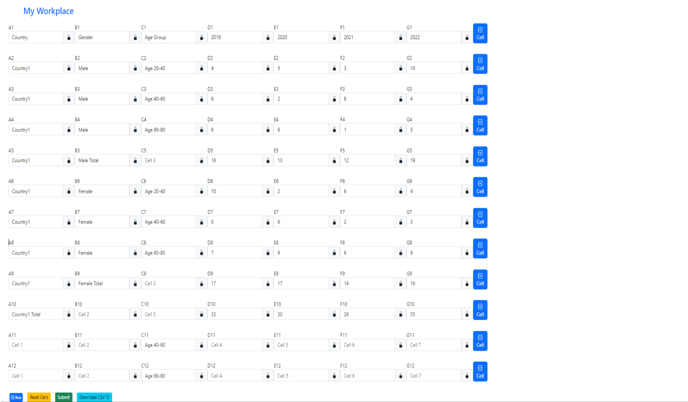

# Forecast Pioneer 📊🚀

Welcome to the Forecast Pioneer repository, home to an innovative prototype designed to organize and manage forecasts effectively using a grid-based system.

## Application Prototype  📝

### Problem Statement
Develop an application prototype to view and manage forecasts for various attributes comprehensively.

### Episode Parameters 🗂️
The prototype showcases an advanced grid layout similar to a Pivot table, organizing forecasts by periods (columns) and offering multi-level drill-downs (rows) for detailed analysis.

#### Expected Interface 🖥️

🔍 The anticipated interface demonstrates a configurable grid enabling diverse drill-down levels and seamless value aggregation upon modifications.

#### Actual Prototype 🚀

🌟 Our application prototype mirrors the expected design, ensuring configurable drill-downs, automated value aggregation, and efficient data copying functionalities between cells.

### Rules & Requirements 📋
- Configure custom drill-down levels and labels effortlessly.
- Enable automatic value aggregation across levels on input or change.
- Redistribute values based on specified ratios for fresh inputs.
- Facilitate seamless information copying between cells or sets of cells.

### Tech Stack & Future Assumptions 🛠️
- Angular version: 15.2.8
- Utilizes MongoDB for efficient data handling.
- Future improvements: UI enhancements, cloud deployment for scalability.

### Deployment & Security Features 🔒
- Deployable on cloud platforms for scalability.
- Implements user authentication and authorization for secure access.

### Functionality Implemented:
- **Download as CSV:** Users can download data as CSV for offline analysis.
- **Revenue Operations:**
- **Good User Experience:**
- **Dynamic Configuration:**
- **Advanced Analytics:**
- **Interactive Visualization:**

### Drawbacks 📉
- UI Breakdown for large width worksheets.

### Formulas Available:
# | Action         | Formula                                 | Description
--|----------------|-----------------------------------------|-----------------------------------------
1 | Sum            | =Sum(Ai : Aj) where 1 ≤ i < j ≤ n      | To get the sum of a particular category.
2 | Grand Total    | =Sum(Ai , Aj) where 1 ≤ i < j ≤ n      | To get the sum of categories.
3 | Copy           | p=Copy(Ai:Aj) where 1 ≤ i < j ≤ n, p    | To copy a row's value into multiple rows.
4 | Distribute     | p=Distribute(Ai.....Aj) where 1 ≤ i < j ≤ n, p | To distribute Grand total among other rows based on ratios.

### Prototype Demonstration
[Prototype Demo](./ngt3/src/assets/videos/NGT_demo.mp4) - This video showcases the prototype's controls and functionalities.

